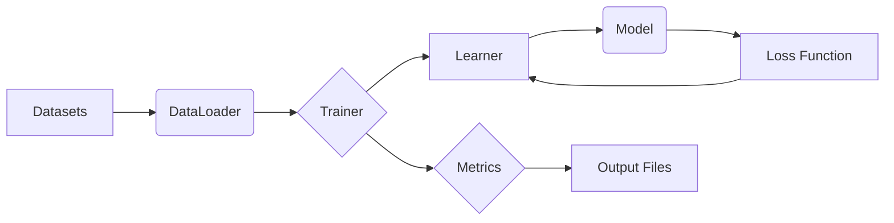

## 📄 Descripción general del proyecto

-   **Nombre del código:** trainer.py
-   **Versión:** N/A
-   **Explicación general:** Este script implementa un orquestrador de entrenamiento para aprendizaje continuo (continual learning), con funcionalidades de guardado por tarea y métricas completas. Permite entrenar un modelo en una secuencia de tareas, guardando checkpoints, predicciones y etiquetas para cada tarea, calculando matrices de confusión y registrando métricas de rendimiento.
-   **Qué problema resuelve el código:** Aborda el problema del olvido catastrófico en modelos de aprendizaje automático al entrenarlos secuencialmente en diferentes tareas. Proporciona un marco para evaluar y mitigar este problema mediante el uso de diferentes estrategias de aprendizaje continuo.

## ⚙️ Visión general del sistema



-   **Tecnologías utilizadas:**
    *   Python 3
    *   PyTorch
    *   tqdm
    *   PyYAML
    *   JSON
    *   CSV
-   **Dependencias:**
    *   torch
    *   torch.utils.data
    *   tqdm
    *   PyYAML
    *   argparse
    *   pathlib
    *   typing
    *   csv
    *   json
-   **Requisitos del sistema:**
    *   Entorno Python 3.
    *   Instalación de las dependencias listadas.
    *   Opcional: GPU compatible con CUDA para aceleración del entrenamiento.
-   **Prerrequisitos:**
    *   Conocimiento básico de PyTorch y aprendizaje automático.
    *   Familiaridad con conceptos de aprendizaje continuo (continual learning).

## 📦 Guía de uso

-   **Cómo usarlo:** El script se ejecuta desde la línea de comandos, aceptando argumentos para configurar el entrenamiento, el conjunto de datos, el modelo y la estrategia de aprendizaje continuo.
-   **Explicación de los pasos:**
    1.  **Entrada:** El script recibe argumentos de línea de comandos que especifican la configuración del experimento, incluyendo el conjunto de datos, la arquitectura del modelo, la estrategia de aprendizaje continuo, los hiperparámetros de entrenamiento y la ubicación para guardar los resultados.
    2.  **Procesamiento:**
        *   Carga y divide el conjunto de datos en tareas.
        *   Inicializa el modelo y el "learner" (implementación de la estrategia de aprendizaje continuo).
        *   Entrena el modelo secuencialmente en cada tarea.
        *   Evalúa el modelo después de cada tarea y calcula las métricas de rendimiento.
        *   Guarda los checkpoints del modelo, las predicciones, las etiquetas y las matrices de confusión para cada tarea.
        *   Registra todas las métricas en un archivo JSON.
    3.  **Salida:** El script genera varios archivos de salida, incluyendo:
        *   Checkpoints del modelo para cada tarea (`ckpt_t{t}.pt`).
        *   Predicciones y etiquetas para cada tarea (`preds_task{t}.pt`).
        *   Matrices de confusión en formato CSV para cada tarea (`confmat_task{t}.csv`).
        *   Un archivo JSON que contiene un resumen de las métricas de rendimiento (`metrics.json`).
-   **Caso de uso de ejemplo:**

```python
import torch
from models import Classifier, get_backbone
from learner import build_learner

# Define el número de clases por tarea
num_classes = 2

# Inicializa el modelo
model = Classifier(get_backbone("resnet18"), num_classes=num_classes)

# Construye un "learner" con la estrategia "finetune"
learner = build_learner("finetune", model, lr=1e-3)

# Crea datos de ejemplo (simulando un batch)
x = torch.randn(64, 3, 224, 224)  # 64 imágenes de tamaño 224x224
y = torch.randint(0, num_classes, (64,))  # Etiquetas para las 64 imágenes
batch = (x, y)

# Realiza un paso de entrenamiento
loss = learner.observe(batch)

print(f"Loss: {loss:.4f}")
```

## 🔐 Documentación de la API

El código proporcionado no define una API en el sentido tradicional (endpoints HTTP, etc.). Sin embargo, define una clase `Trainer` con un método `run` que orquesta el proceso de entrenamiento.

## 📚 Referencias

*   **PyTorch:** [https://pytorch.org/](https://pytorch.org/)
*   **Aprendizaje Continuo (Continual Learning):** [https://ruder.io/research/](https://ruder.io/research/)
*   **Estrategias de Aprendizaje Continuo:**
    *   **Finetuning:** Transferencia de aprendizaje, ajuste fino de un modelo pre-entrenado.
    *   **Replay:** Almacenamiento y reutilización de ejemplos de tareas anteriores.
    *   **EWC (Elastic Weight Consolidation):** [https://arxiv.org/abs/1612.00796](https://arxiv.org/abs/1612.00796)
*   **Matriz de Confusión:** [https://en.wikipedia.org/wiki/Confusion_matrix](https://en.wikipedia.org/wiki/Confusion_matrix)
